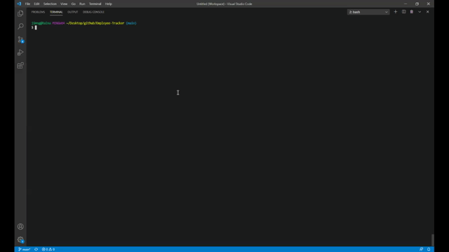

# Employee-Tracker

## Description 

Developers are often tasked with creating interfaces that make it easy for non-developers to view and interact with information stored in databases. Often these interfaces are known as **C**ontent **M**anagement **S**ystems. The goal of this project is to architect and build a solution for managing a company's employees using node, inquirer, and MySQL.

## Objective

  * Add departments, roles, employees

  * View departments, roles, employees

  * Update employee roles

  * Remove Employees

## Link to Demo

  [Youtube Link](https://youtu.be/GMBdOHThr7w)

## Installation

To install the necessary dependencies, type in the following command line:

    npm install

## Usage

To run the application, type in the following command line:

    npm start

